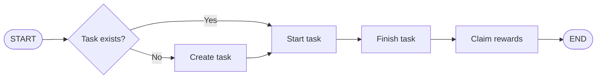
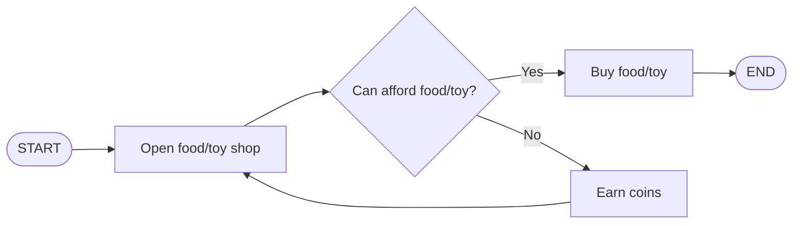
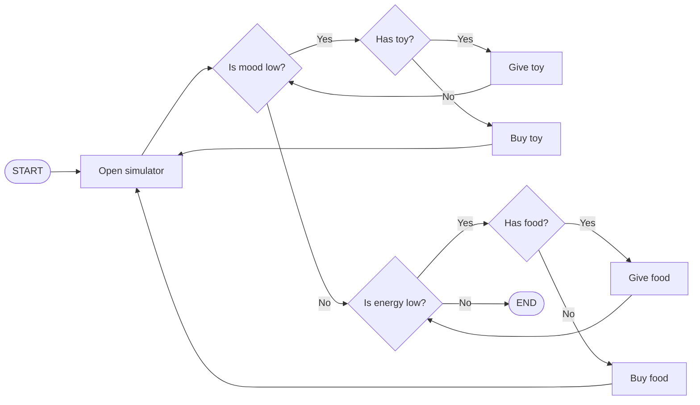
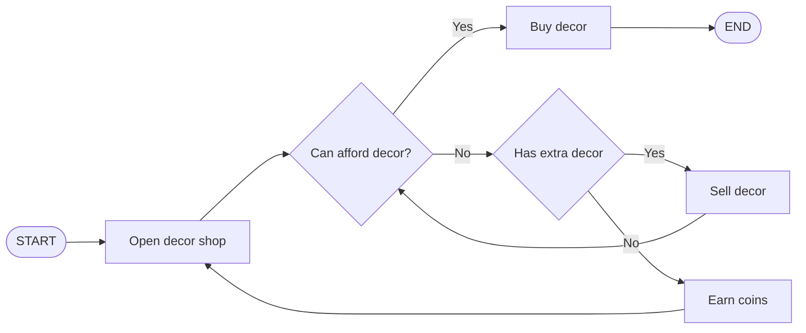
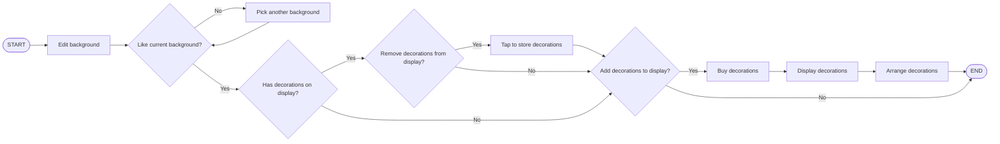
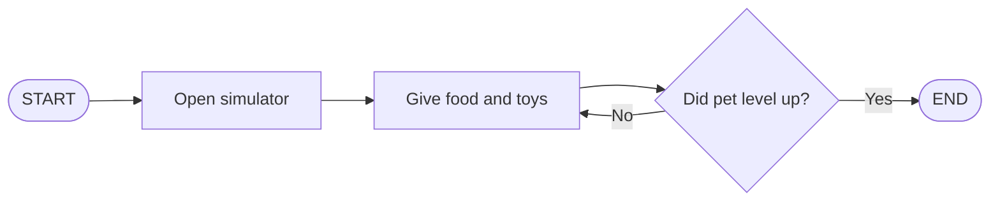
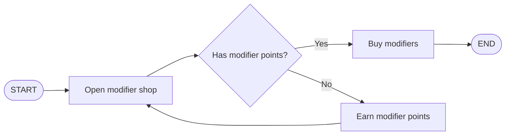

## Pawductive 🐾
> Gamifying productivity, one pet at a time.

A native iOS gamified productivity application developed in Swift.

Built for Orbital 26 by Team Pawductive **(Team 6658).**

**Targeted Level of Achievement: Gemini**

> NOTE: This README is best viewed either on the project's GitHub repository or with [HackMD](https://hackmd.io/@6658/H1ERYqn1Ge) for the best  reading experience.

---

## 💡 Motivation

In a digital era where productivity is highly valued, we wanted to make something convenient where users can reliably achieve their productivity goals while being able to enjoy the process - so we turned to the idea of using virtual pets as free dopamine hits. 

Pets are widely loved yet expensive in real life, so we thought of creating a gamified mobile application where users can have fun raising and training virtual pets by responsibly setting their own fixed tasks, adhering to doing them without other distractions, and completing them for in-game rewards. 

---

## User Stories

1. As a student, I want to list down my tasks so that I can remember to finish them.
2. As a student, I want to receive rewards when I finish my tasks so that I have the motivation to start working on them.
3. As a student, I want to put my phone away when I am studying so that I can study efficiently.
4. As a student, I want to know how much time I have spent on the app so that I can know whether the app is effective. 
5. As a pet lover, I want to own a virtual pet so that I can bring my pet anywhere with my phone. 
6. As a pet lover, I want to give my virtual pet food and toys so that my virtual pet is happy.
7. As a pet lover, I want to decorate the area around the pet so that the pet feels comfortable. 
8. As a gamer, I want to upgrade the simulator so that I can keep the pet happy and well fed. 
9. As a gamer, I want to earn coins when I discover new features so that I can keep the pet happy and well fed.
10. As a gamer, I want to unlock achievements so that I can feel proud when I complete difficult tasks. 

---

## User Flow
### Earn Coins

### Buy Food/Toys

### Give Food/Toys

### Buy/Sell Decor

### Change Background

### Earn Modifier Points

### Buy Modifiers

---

## 🚀 What's New (Milestone 3 Summary)

The application has now been polished into a production-ready, feature-complete iOS application. The development for this final milestone focused on native platform integrations (iOS 18 Widgets), granular task customization, interactive analytics, and user quality-of-life enhancements.

* **Pet Hibernation & Expanded Achievements:** Added a state-freezing hibernation toggle to halt mood/energy decay during absences, plus 12 new pet achievement milestones
* **Dynamic Focus Multipliers, Task Categorization & Ordering:** Streak-based coin multiplier, tagging of tasks with user-customisable categories, and persistent custom ordering of tasks on the task queue screen
* **Timer Auto-Lock Prevention:** Configured screen auto-lock prevention during active timers, smooth view-reset transitions, and adaptive `HH:MM:SS` duration formatting for long study blocks
* **Home Screen Widgets:** Custom WidgetKit extensions displaying live pet status, room decorations, and quick-claim reward progress
* **Statistics Dashboard:** Dedicated analytics hub featuring Apple's native **Swift Charts** framework (`SectorMark`) to render interactive category focus time breakdowns
* **Social Share Sheets & Snapshot Cards:** Implemented native iOS `ShareLink` and `ImageRenderer` engines to generate high-resolution snapshot graphics of user streaks and pet rooms that can be saved and shared to other applications

More detailed information on new feature implementations for Milestone 3 can be found in the dedicated section below.

---

## 🛠️ Core Features (Milestone 1)

### 1. Task Queue (Feature 1)
The task queue allows users to plan and manage their work blocks before beginning focus sessions.
*   **Persistent Storage:** Built using **SwiftData**. Queued tasks are saved to the device's local database and survive app restarts.
*   **Intuitive UI:** Built using **SwiftUI**, with smooth animation, keyboard-type protection for duration inputs, and swipe-to-delete functionality.
*   **Visual Completion Feedback:** Completed tasks are persistently marked with a green checkmark upon claiming rewards.

### 2. Productivity Timer (Feature 2)
The timer forces users to put their phones down and focus on the task at hand without exiting or being distracted.
*   **MVVM State Engine:** Controlled by a responsive `TimerViewModel` using Swift's modern `@Observable` macro.
*   **Interactive Progress Ring:** A clean circular progress ring that animates smoothly on a second-by-second basis.
*   **Anti-Cheat "Stick" Logic:** Utilizing SwiftUI’s `@Environment(\.scenePhase)`, the app instantly detects if the user exits the app or locks their screen. If they leave, the timer is invalidated, the session is failed, and they are immediately booted back to the task queue with no rewards.

### 3. Pet Simulator (Feature 3)
The user can rename and interact with their pet over here. The pet has mood and energy levels which decay over time. Mood decays exponentially, energy decays linearly. User can give food and toys to their pet to restore their mood and energy levels. User cannot give food to their pet when energy is full. User cannot give toys to their pet when mood is full or when their pet does not have enough energy.

### 4. Food and Toy Shop (Feature 4)
User can buy food and toys for their pets here. Food and toys can be bought using the coins earned from the timer. More expensive items generally restore mood and energy by a larger amount. 

---

## 🔨 Expanded Feature Implementation (Milestone 2)

### 1. Pet
More new features were added for the pet, most of which were targeted at making the pet and pet room more lively and animated, as well as some new objectives and quality of life features.

* **User-interactive animations for pet sprite:** The pet now has multiple different sprites that change depending on the pet's energy and mood. When the pet is low on energy, the pet will be sleeping. When the pet has sufficient energy, the pet will be happy, normal or angry according to the pet's mood. The eating and playing sprite is shown for 3 seconds when the user gives food and toys to their pet. A small animation is also played when the user taps on the sprite. This shows that the pet loves to receive pets from the user. 
* **Level system and modifiers:** The pet will gain experience when the user gives the pet food and toys. Expensive food and toys increase experience by a larger amount. Each level requires 3000 experience points. Maximum mood and energy increases when the pet levels up. In addition, the user will receive 3 modifier points which can be used to upgrade modifiers in the modifier shop. Modifiers can reduce the cost of food and toys, increase the amount of mood and energy the pet can gain from food and toys, and reduce the rate at which mood and energy levels decay. Users can mix and match the modifiers as they level up their pet to customize how they increase their pet to max level. 
* **Simulator background and decorations:** When the user first launches the simulator, they are greeted with an empty room which is the default background. The user can spend their coins in the decoration shop to buy decorations. The user can arrange and layer the decorations to decorate the background according to their preferences. In additon, the user can explore a different set of decorations by changing the simulator background from room to yard. Expensive decorations show that the user has focused for a significant amount of time to earn coins to buy the decorations.
* **Quality of life features**: Mood and energy descriptions are displayed over the value bars to help the user understand how food and toys change the mood and energy levels. 

### 2. Shop
Shop items are now presented in greater detail, with users now able to see each item's precise effect on their pet's mood and energy before they purchase it. The mood and energy values and the cost of food and toys are updated when the user buys the corresponding modifier from the modifier shop. 

### 3. Tasks
A couple of changes and new features were updated with regards to tasks, mainly targeted around a better user experience with regards to completing tasks.

* **Dynamic currency gain:** The old formula for calculating how many coins a user gained for time spent on a task was a flat $c = t$ (where $c$ is coins earned and $t$ is time spent in minutes), which is simplistic and does not accurately reflect the difficulty of staying focused for longer periods of time. The new formula has been updated to a ramping quadratic reward curve following the equation $c = t + \frac{t^2}{100}$, so that every extra minute spent on the same task incrementally rewards more coins to the user.
* **User task daily completion streak:** On top of the other main motivation for the user to complete tasks regularly (to maintain the well-being of their virtual pet), it was decided that an additional motivation would be helpful to make sure users had a reason to stay consistent with their productivity. As such, a task completion streak was implemented, with users maintaining their streak as long as they complete at least one task a day. The user's current streak can be viewed from the profile tab.

### 4. Timer
Some changes were made to the functionality of the task timer, all of which were centred around user quality of life and making the timer less strict and adjustable to the user's needs.

* **Timer Pause Toggle:** Previously, the user could not pause the timer, and leaving the application would cause the task to fail immediately. While this strict logic is part of the key features of the app, we recognised that this could prove a usage impediment to users who require usage of their phone as an important part of their workflow. As such, we have implemented an ability to pause the timer: a functionality that the user can enable at their own discretion from the app settings. When the pause toggle is on, the timer screen now has a pause button, which the user can press to stop the timer, and subsequently leave the application without failing the task. After returning to the app, the user can click resume to continue where they left off.
* **Customisable app switch-out grace period:** Previously, the timer would fail instantly the moment the app detected that it had been backgrounded. Once again, while this is in line with the strict focusing that is part of the app's key selling point, we also recognised that this is not always possible, with possible situations arising such as users absent-mindedly clicking banner notifications by accident, which again would be a deterrent for would-be users of the app. To deal with this, we now allow users to set a custom application switch-out grace period of anywhere between 0 seconds (instant fail) to 10 minutes. As long as users return to the application within their set time, they can leave the app for that duration of time without the task failing on return. This setting can also be customised in the app settings.

### 5. Profile
The biggest change in Milestone 2, we added a brand new Profile tab alongside the already existing tabs of Tasks, Pet, and Shop, making it the 4th tab accessible from the bottom tab bar. The Profile tab contains several pieces of useful information about the user of the application, as well as navigation links to additional view where the user can change their user settings and user notifications.

* **Daily missions:** The user receives 3 missions each day. The missions refresh at midnight. The user can claim coins when they complete the daily missions. Missions include completing tasks, buying food/toys/decors, giving food/toys and displaying decor. Missions details can be modified to require a specific item. Mission requirements can be modified to modify the difficulty. These missions encourage old users to stay consistent and encourage new users to explore features within the app. 
* **User statistics:** Users can now view their user statistics. This consists of their current daily task streak, as well as their total tasks completed and total minutes focused.
* **User achievements:** Users now also have achievements that they can view and unlock as they continue to use the application. Users can unlock these achievements and have them display at the top of their achievement list as they continue to complete tasks and accumulate focus minutes.
* **User settings:** The top right of the Profile tab has a clickable gear icon that functions as a navigation link to the user settings view. Inside the user settings view, there is a toggle option for enabling or disabling the previously-mentioned timer pausing feature. Additionally, there is a click-through navigation link that takes the user to the grace period picker view, where they can use slider wheels for minutes and seconds to granularly adjust their preferred app switch-out grace period.
* **User notifications:** The app will request for permission to send notifications when the user first launches the app. After the app receives permission to send notifications, the user can manage the notifications sent by the app tapping on the bell icon. The user can decide if the app should notify the user when the pet is low on mood or energy. In addition, the user can decide when the app should notify the user when their streak is expiring. These notifications are off by default to reduce disruption. 

---

## ⚒️ Additional Features (Milestone 3)

### 1. Pet
New features were added to the simulator. The hibernation toggle will benefit users who do not use the app frequently and the simulator widget makes it easier to care for their pet.

* **Hibernation Toggle:** The user can turn on this feature to pause the mood and energy levels. This feature will keep their pet happy and healthy when the user does not plan or is unable to use the app for a long period of time. Because the mood and energy levels do not decrease, the user cannot give food and toys once the mood and energy levels are full. Therefore, the user is not encouraged to turn on this feature if they wish to level up their pet. This message is delivered via an alert when the user tries to turn on this feature.
* **Simulator Widget:** The user can use the widget to monitor their pet without opening the app. The user can use the widget to check the mood and energy levels. If the pet is low on mood and energy, the user can tap on the widget to open the app and manage their pet. In addition, the widget uses the simulator background. The user can decorate the background and the decorations will be shown in the widget.

### 2. Tasks
Numerous changes were made to how tasks were handled in Milestone 3, mainly centred around improved UX and balancing the in-app economy.
* **Coin Streak Multiplier:** To reward users for daily consistency, a streak-based multiplier is applied to all completed focus sessions. For every consecutive day of an active focus streak, users earn an additional 2% bonus on total coins earned (e.g. a 10-day streak would grant an additional 20% bonus). To maintain game economy balance, this multiplier is capped at a maximum of 50%.
* **Dedicated Task Creation Screen:** Rather than creating a task by typing out the name of it and duration in minutes at the top of the task queue screen, there is now a button in its place that takes users to a dedicated task creation screen where users can adjust various properties of the task such as its name and duration in hours and minutes for a more intuitive user experience.
* **Task Categories:** Users can now also apply custom categories to their tasks (e.g. `"📚 Study"`, `"💼 Work"`). When creating a new task, a sub-menu picker allows users to select a category from those available. Users can also view, delete, and create custom categories with custom emojis in their user settings.
* **Task Order Organisation:** Users can manually reorder and prioritise their task list using native iOS drag-and-drop gestures (`.onMove`) by pressing the **`Edit`** button on the top right of the task queue screen.

### 3. Timer
When testing the app on our phones, we noticed that the phone will auto lock when the user does not interact with their phone. If the timer was counting down, the user would lose their progress when they unlock their phone. To resolve this issue, we configured the phone to stay on when the user is on the timer screen. To conserve battery, the user is advised to dim their screen when the timer is counting down. 

To support longer tasks which require multiple hours, when the time left is over 1 hour it is displayed in HH:MM:SS and when the time left is less than 1 hour it is displayed in MM:SS. In addition, the timer will only be reset after the view fully disappears from the screen to hide ugly reset animations.

### 4. Profile
Many features were added to the profile page for milestone 3. Features include daily rewards to encourage the user to use the app every day, a button to share the daily task streak with other users, and 12 new achievements for the pet simulator.

* **Daily Reward:** The user can claim a random food or toy from the top of profile tab once a day. Even though the user has a chance to receive the best food or toy, the user must purchase additional food and toys to keep the pet both happy and healthy. The reward encourages the user to open the app and complete the daily missions for more rewards. To reward users who use the app frequently, users can receive up to 90 coins together with with the random food or toy when they claim their reward every single day. 
* **Reward & Mission Widget:** The user can use this widget to claim daily rewards and check daily missions without opening the app. The user can check which missions are incomplete by looking at the current progress for each mission. The user can use this widget to ensure that all the missions have been completed so they will not miss any additional rewards. By encouraging the user to complete missions, this will encourage the user to use the app.
* **Share Sheet:** The user streak card that was added earlier in Milestone 2 has now been upgraded with a sharing function. Users can export and share their active focus streaks directly from the streak card. This generates a high-resolution custom snapshot graphic that displays their current streak, pet, customised room background, and focus statistics. This functionality is only accessible when the user has a streak of 1 or higher.
* **Statistics:** User statistics were migrated away from the Profile screen and replaced by a navigation link to its new location on a dedicated Statistics screen (check below for more details). 
* **Pet Achievements:** 12 new achievements were added to the list of achievements. These achievements include milestones on the number of food and toys given to the pet and the longest duration where the pet was high on mood and energy. These achievements give users a goal and fills them pride when they finally unlock all the achievements.

### 5. Statistics
As mentioned earlier, all statistics have now been moved to a brand new Statistics Dashboard, accessible from the *"View More Statistics"* card on the Profile tab. Changes here were made to supplement the already-existing user statistics from Milestone 2.

* **Category Statistics:** In addition to overall numbers for task completion, users can now also visualise their completed tasks per-category. An interactive donut chart provides an easy breakdown of the user's exact percentage and minute breakdown of focus time across all task categories.
* **Pet Statistics:** Users can track their progress for the pet achievements here. The user can check the total number of food and toys given to the pet and the current number of consecutive days where the pet was high on mood and energy. These statistics tell the user whether they have put in the time and effort to care for their pet.

---

## 🚧 Future Plans

While there are no active plans to make any major changes to the application with the completion of Milestone 3, below are some additional features that could be considered in the future should this project be revisited.

### 1. Pet
* **Pet accessories:** Allows users to purchase accessories that their pet can wear.
* **Different pets:** Users can change the pet living in the simulator. Users can choose from multiple breeds and species. Food and toys sold will depend on the species.

### 2. Tasks
* **Task widget:** The widget will highlight important tasks and the user can start a task by tapping on the widget. The user can control which tasks appear in the widget.
* **Task deadlines:** Let the user set deadlines for each task. The user can schedule notifications to remind the user when the deadline is approaching.
* **Sort and filter:** Let the user can sort and filter tasks according to task details.

### 3. Timer 
* **Lock screen support:** Progress will not be lost when the phone is locked.
* **Live activity:** Display the countdown in dynamic island or lock screen notifications. 
* **Ambient audio:** Allow users to pick ambient white noise to be played on their timer screen, such as lofi music, rain, or other noise that helps the user focus.

### 4. Achievements
* **Unlock alerts:** The user is notified when they unlock an achievement. 
* **Share sheets:** The user can share images to show that they have unlocked an achievement. Similar to the share sheet for the daily task streak.

### 5. Others
* **Motivational notifications:** Motivational notifications will be delivered once a day. 
* **Weekly leaderboard:** Users will be ranked according to the minutes focused each week. Users who finish at the top of the leaderboard can earn custom rewards.
* **Friend system:** Users can add friends. Pets can receive food and toys from a friend. 
* **App-wide themes:** Users can change app-wide visual themes via settings.

---

## 🏗️ Software Engineering Best-Practices & Application Architecture

### 1. Model-View-ViewModel (MVVM)
The UI is decoupled from the business logic to ensure a testable and maintainable codebase. This provides several key advantages, such as decoupling between frontend and backend, greater ease of testing, and reusability.

* **Models:** These `.swift` files represent the raw data structures and database schemas of the application. Models are pure structures or reference types that hold state and are independent of the UI. The current list of models include `CategoryStat`, `Background`, `Decor`, `ShownDecor`, `StoredDecor`, `DailyMission`, `MissionDetails`, `Modifier`, `DailyReward`, `Food`, `Toy`, `Pet`, `TaskCategory`, `TaskItem`, `Achievement`, `UserProfile`, and `UserStats`.
* **Views:** These `.swift` files represent the declarative UI of the application. Views are solely responsible for rendering layouts, responding to user interactions, and observing realtime changes in viewmodels. The current list of views include `PetSimulatorWidget`, `RewardMissionWidget`, `StatsDashboardView`, `BackgroundView`, `CanvasView`, `DecorShopView`, `DecorStoreView`, `ShopDecorView`, `StoreDecorView`, `DailyMissionsView`, `ModifiersView`, `ModifierView`, `NotificationManagerView`, `DailyRewardView`, `CategoryManagerView`, `GracePeriodPickerView`, `SettingsManagerView`, `StreakShareCard`, `ShopCategory`, `FoodShopView`, `ShopView`, `ToyShopView`, `FoodStoreView`, `PetSimulatorView`, `ToyStoreView`, `ValueBarView`, `TaskCreationView`, `TaskQueueView`, `TimerView`, `ProfileView`, `UserCoinsView`, `ContentView`, and `Text+Extensions`.
* **ViewModels:** These `.swift` files represent the "brain" and the bridge of the application. Viewmodels are state-driven, observe user interactions, perform calculations, run async timers, and coordinate context transactions with the databases. The current list of viewmodels include `ClaimMissionIntent`, `MissionManager`, `NotificationManager`, `ClaimRewardIntent` `SettingsManager`, `TimerViewModel`, and `DataContainer`.

Additionally, to round up the list of `.swift` files that are part of the main application, `PawductiveApp` serves as the entry point for the application.

### 2. SwiftData Schema & Local Persistence
A clean, relational database schema is used to manage all user, task, pet, and game-economy data locally using **SwiftData**.
* `TaskItem`: Tracks individual task titles, expected focus durations, completion states, creation timestamps, and assigned category names.
* `TaskCategory`: Tracks default and custom user task categories, including display names and assigned emoji category icons.
* `UserProfile`: Tracks the user's active, spendable coin wallet, along with dictionaries storing their food and toy inventories.
* `Pet`: Tracks the pet's name, age, level progression, cumulative XP, and real-time mood and energy decay.
* `UserStats`: Tracks global lifetime user progression, including total completed tasks, total focus minutes, lifetime coins earned, and consecutive daily focus streaks.
* `DailyMission`: Tracks the title, target requirements, active progress, claimed states, and reward amounts of individual daily missions.
* `MissionManager`: Manages the current active daily missions list, checking calendar dates to trigger daily resets, and randomly drawing new missions from the global catalog.
* `DailyReward`: Tracks daily login reward states, rolling random food/toy items, bonus coin payouts, claim statuses, and calendar claim timestamps.
* `Modifier`: Tracks unlockable, level-up upgrades for pet decay rates and item efficiencies (e.g., lower store prices, reduced energy/mood decay, increased food calories).
* `NotificationManager`: Tracks user configurations for local iOS push notifications (such as toggling alerts for low pet stats or expiring daily streaks).
* `Background`: Represents distinct visual backdrops (e.g., the indoor "Room" or outdoor "Yard") where the pet resides.
* `StoredDecor`: Represents individual decoration assets owned by the user, linked to a specific background room.
* `ShownDecor`: Represents active decorations currently placed in the pet's environment, saving their relative coordinate ratios and layout order.

**Explicit Saving:** To prevent data loss when developers force-kill the app during Xcode simulation, explicit context saving (`try? modelContext.save()`) on database transactions is implemented.

### 3. Continuous Integration & Unit Testing
Implements the modern **Swift Testing** framework to write test suites verifying the core logic. By utilizing isolated, in-memory databases (`isStoredInMemoryOnly: true`) during testing, database saves, deletes, and updates are verified without polluting the physical application files on disk. The current list of `.swift` test suites implement the following unit tests and ensure the following:

**`BackgroundTests`**
* _`testBuyDecor`_: Coins are deducted and number of stored decor increases.
* _`testSellDecor`_: Coins are refunded and number of stored decor decreases.
* _`testDisplayDecor`_: Increases shown decor, decreases stored decor.
* _`testStoreDecor`_: Increases stored decor, decreases shown decor.
* _`testReorderDecor`_: Selected decor is layered over other decors.

**`DailyRewardTest`**
* _`testUpdate`_: Bonus coins are accurately awarded the next day dependent on if the daily reward was claimed.
* _`testClaimReward`_: Daily rewards are claimed and reflect in the user inventory accurately.

**`MissionTests`**
* _`testUpdateMission`_: Mission progress is updated when details match.
* _`testResetMission`_: Mission progress and reward claim status is reset accurately.
* _`testInitialMissions`_: The number and initial state of missions are correct.
* _`testRefreshMissions`_: Old missions are reset and  new missions are drawn.

**`ModifierTests`**
* _`testPetMoodModifier`_: As level increases, mood half life constant increases.
* _`testPetEnergyModifier`_: As level increases, daily energy consumption decreases.
* _`testFoodCostModifier`_: As level increases, cost of food decreases.
* _`testFoodMoodModifier`_: As level increases, food increases mood by a larger amount.
* _`testFoodEnergyModifier`_: As level increases, food increases energy by a larger amount.
* _`testToyCostModifier`_: As level increases, cost of toys decreases.
* _`testToyMoodModifier`_ As level increases, toys increase mood by a larger amount.
* _`testToyEnergyModifier`_: As level increases, toys decrease energy by a smaller amount.

**`PetTests`**
* _`testCanReceiveFood`_: Pet can receive food if and only if energy is not full.
* _`testReceiveFood`_: Pet attributes are updated accurately on receiving food.
* _`testCanReceiveToy`_: Pet can receive toy if and only if mood is not full and pet has sufficient energy.
* _`testReceiveToy`_: Pet attributes are updated accurately on receiving toy.
* _`testUpdatePet`_: Pet attributes update accurately on passage of time.
* _`testExperiencePoints`_: Modifier points, maximum mood and energy scale with level.
* _`testImageState`_: Displays correct sprite according to mood, energy and state.
* _`testFoodStatistics`_: Pet statistics are accurately updated on receving new food.
* _`testToyStatistics`_: Pet statistics are accurately updated on receiving new toy.
* _`testMoodStreak`_: Pet mood streak is accurately updated for live streak and max streak statistics dependendent on pet mood relative to threshold.
* _`testEnergyStreak`_: Pet energy streak is accurately updated for live streak and max streak statistics dependent on pet energy relative to threshold.

**`SettingsManagerTests`**
* _`testSettingsManagerMemoryAddress`_: Settings manager memory address is shared.
* _`testSettingsManagerPersistence`_: User global settings are maintained and persist.

**`StatsDashboardTests`**
* _`testCategoryFocusTimeAggregation`_: Focus time is aggregated correctly per task category.
* _`testCategoryStatSortingByHighestFocusTime`_: Task categories are accurately sorted in order by focus time from highest to lowest.

**`TaskItemTests`**
* _`testCreateAndSaveTask`_: Tasks can be saved successfully to the local database.
* _`testDeleteTask`_: Tasks can be deleted successfully from the local database.
* _`testToggleTaskCompletion`_: Task state can be toggled succesfully from incomplete to complete.
* _`testTaskItemInitializationDateTolerance`_: Tasks are created in expected time with date tolerance.
* _`testTaskItemDefaultCategory`_: Tasks initialise with the default category.
* _`testTaskItemCustomCategory`_: Tasks can be assigned accurately with custom categories.
* _`testDefaultCategorySeeding`_: Default categories selection is seeded on first run.
* _`testCreateAndSaveCustomUserCategory`_: Custom user categories can be created and saved successfully.
* _`testDeleteCategoryFromDatabase`_: User categories can be deleted successfully.
* _`testTaskReorderingSortOrder`_: Tasks can be reordered successfully with persistence.

**`TimerViewModelTests`**
* _`testInitialState`_: Timer starts with clean, empty values.
* _`testStartTimer`_: Minutes and seconds are calculated correctly on timer start.
* _`testFailSession`_: Session failure resets the timer state.
* _`testClaimRewardsCreatesProfileAndAddsCoins`_: Rewards are written accurately to the local database on timer completion.
* _`testStartingNewTimerWhileAlreadyRunningOverwritesSuccessfully`_: Timers running simultaneously are not allowed.
* _`testDynamicCurrGainFormula`_: The correct amount of coins is awarded on completing tasks of various durations based on the ramping quadratic reward formula.
* _`testPauseAndResume`_: Timer paused and running state is accurately reflected on timer pause, resume, and session failure.
* _`testStreakBasedCoinMultiplier`_: The correct amount of coins is awarded on completing tasks with various user streaks based on the user streak multiplier.

**`UserProfileTests`**
* _`testCanAfford`_: User can afford only items that have a price lower or equal to their current coin total.
* _`testBuyFood`_: Food inventory is updated accurately with purchase of food.
* _`testBuyToys`_: Toy inventory is updated accurately with purchase of toy.
* _`testGiveFood`_: Food inventory is updated accurately with usage of food.
* _`testGiveToy`_: Toy inventory is updated accurately with usage of toy.

**`UserStatsTests`**
* _`testUserStatsInit`_: User stats initialise with the correct values.
* _`testSaveAndUpdate`_: User stats save correctly and persist in the database.
* _`testAchievementUnlocks`_: Achievements are unlocked correctly and in order with changes in user stats.
* _`testUserStreak`_: User streak maintains correctly, breaks correctly, and does not double-increment.
* _`testLaunchStreakReset`_: User streak is updated and maintained accurately on app launch.
* _`testStreakExpiryDate`_: User streak expiry date is correctly maintained and updated.

All above unit tests can be run locally using **⌘ + U** within Xcode.

### 4. Version Control & Branching
To support parallel development and maintain a clean repository history, a professional, industry-standard **Git Feature-Branch Workflow** is adopted.

* **Protected `main` Branch:** The `main` branch serves as the stable, production-ready environment. Direct pushes to `main` are strictly prohibited, and all merges into `main` must always contain a fully functional, compilation-safe version of the application.
*   **Feature Isolation:** Every new feature (such as the core timer, user streaks, or pet customizations) is developed in its own isolated branch (e.g., `feat/timer-pause-toggle`, `feature/user-stats-achievements`, `simulator-updates`). This prevents work-in-progress code from disrupting other stable components.
*   **Selective Staging:** When introducing core database models at the start (such as `UserProfile`), the `.swift` model files are selectively staged and merged first before further development elsewhere. This enables asynchronous development by immediately synchronizing and adopting the same database schema on separate branches, eliminating numerous potential SwiftData migration crashes and merge conflicts.
*   **Pull Requests & Code Reviews:** Merging into `main` requires a formal pull request following standard Git terminology and structure conventions. Assigned reviewers are expected to inspect the diff, verify the implementation locally, approve the pull request, and execute the merge.
*   **Local Conflict Resolution:** If merge conflicts arise on common files (such as `ContentView.swift` or `DataContainer.swift`), they are resolved on the local branch before pushing. This guarantees that `main` never experiences "broken-build" states and remains functional.
*   **Structured Commits:** Structured commits with messaging convention (e.g., `Feat:`, `Style:`, `Chore:`, `Test:`) is encouraged. This makes the repository's history easily readable, organized, and searchable.

---

## 💻 Tech Stack
*   **IDE:** Xcode
*   **Language:** Swift
*   **UI Framework:** SwiftUI
*   **Database:** SwiftData
*   **Testing:** Swift Testing (Unit) / XCTest (UI)

---

## 🎮 Access Instructions
**Link to GitHub Repository:** https://github.com/kokjz/pawductive

**Option 1: Run the app via XCode Simulator**

This option requires an Apple Device capable of running macOS Sonoma 14.5 (or later).

1. Download project files from GitHub and unzip pawductive-main.zip
2. Open pawductive-main/Pawductive/Pawductive.xcodeproj in XCode
3. Select run destination in XCode as any iOS Simulator (such as iPhone 17)
4. Run the app by pressing the play icon or by pressing **⌘ + R**

**Option 2: Sideload the app via Sideloadly**

This option requires an Apple Device capable of running at least iOS 18.6 (or later), as well as any device capable of running at least Windows 7 (or later) or macOS 10.12 Sierra (or later). NOTE: Other sideloading options such as AltStore or Feather should also work, but have not been tested. Additionally, all sideloading carries inherent security risks, and we will not be held liable for any negative consequences that the user may be subject to in the process.

1. Download the Pawductive.ipa in the latest [release](https://github.com/kokjz/pawductive/releases)
2. Download [Sideloadly](https://sideloadly.io) for Windows/macOS
3. Sideload the app with your Apple ID into your iPhone by following the standard instructions from Sideloadly.
 
Feel free to drop either of us a message on Telegram @zirong679 or @kokjz if you encounter any issues.

---

## 🖼️ Image Credits
* **Dog Sprites:** Designed by pikisuperstar from [Magnific](https://magnific.com/)
* **Food Sprites:** Designed by YEET from [itch.io](https://2yeet.itch.io/)
* **Toy Sprites:** Desgined by Freepik and bsd from [Flaticon](https://flaticon.com/)
* **Coin Sprite:** Desgined by vectorsmarket15 from [Flaticon](https://flaticon.com/)
* **Room Sprites:** Room and furniture vectors by [Vecteezy](https://www.vecteezy.com/)
* **Yard Sprites:** Designed by upklyak from [Magnific](/GzZykolnSNmNIH1x4YF4Xg)

---

## 📸 App Screenshots

### Task Queue
&nbsp; &nbsp; &nbsp;
&nbsp; &nbsp; &nbsp;
&nbsp; &nbsp; &nbsp;

### Timer Configurations
&nbsp; &nbsp; &nbsp;
&nbsp; &nbsp; &nbsp;
&nbsp; &nbsp; &nbsp;
&nbsp; &nbsp; &nbsp;

### Pet Simulator & Modifiers
&nbsp; &nbsp; &nbsp;
&nbsp; &nbsp; &nbsp;
&nbsp; &nbsp; &nbsp;

### Background & Decorations
&nbsp; &nbsp; &nbsp;
&nbsp; &nbsp; &nbsp;
&nbsp; &nbsp; &nbsp;
&nbsp; &nbsp; &nbsp;

### Food & Toy Shop
&nbsp; &nbsp; &nbsp;
&nbsp; &nbsp; &nbsp;

### User Profile
&nbsp; &nbsp; &nbsp;
&nbsp; &nbsp; &nbsp;
&nbsp; &nbsp; &nbsp;
&nbsp; &nbsp; &nbsp;

### Settings & Notifications
&nbsp; &nbsp; &nbsp;
&nbsp; &nbsp; &nbsp;
&nbsp; &nbsp; &nbsp;
&nbsp; &nbsp; &nbsp;

### Widgets & Share Sheet 
&nbsp; &nbsp; &nbsp;
&nbsp; &nbsp; &nbsp;
&nbsp; &nbsp; &nbsp;
